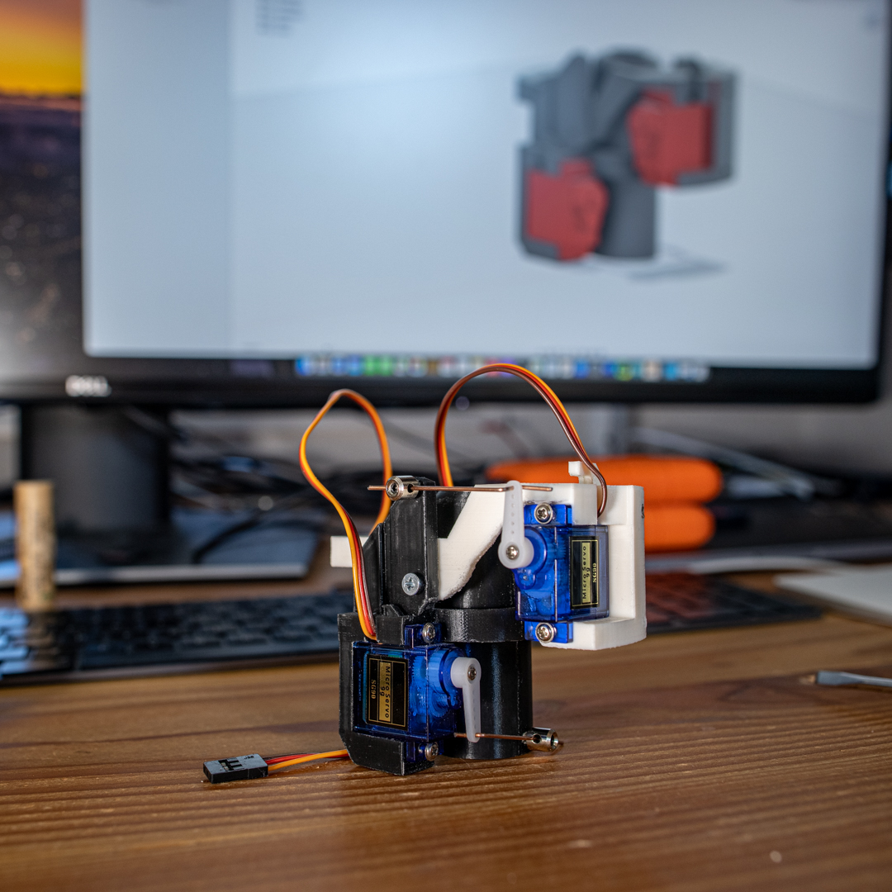
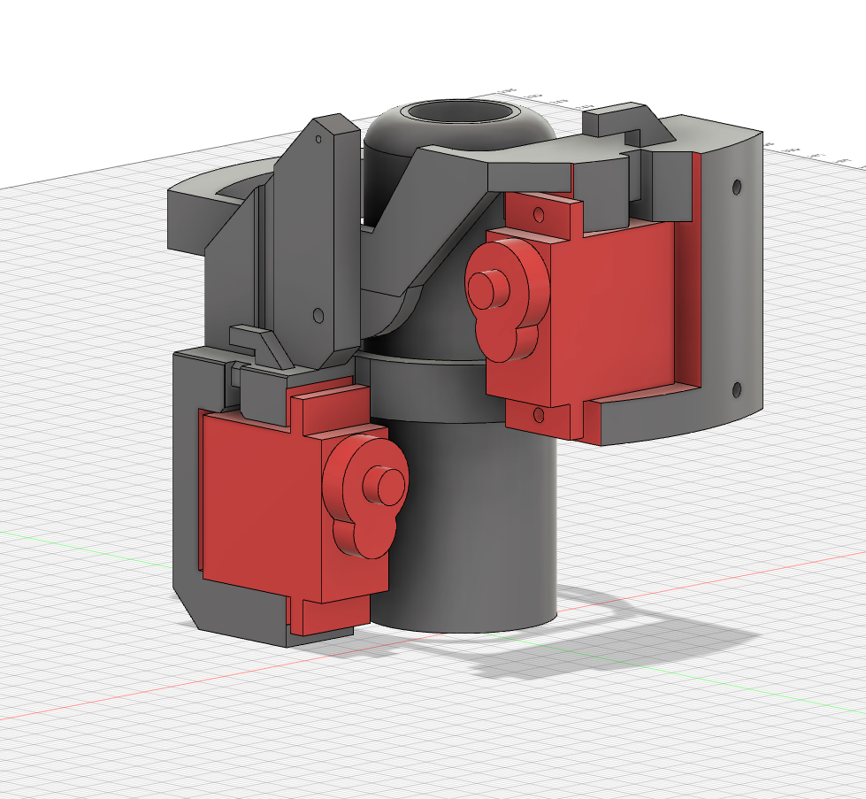

# TVC_Sytem_Arduino

## Context:
One problem in launching a rocket is to keep it on the desiered flight path. To do this rockets like SpaceXs falcon 9 have the exhaust of the engine mounted onto a gimbal with which the thrust can be vecotred and so stear the rocket in flight. 

## Task:
Making a Thrust Vector Controll System for a moddel rocket. The System must be able to hold a C6 rocked motor and Vector the thurst at least 10° in pich and yaw. The Gimal must be 3D printed with 2 Servo motors to controll the angel of the gimbal. The software interface will be a C++ class which will set the gimbal angel and prevent gimbal lock.

## Result:
#### Hardware
Final Hardware



### Files in this Repo
```
gimbal.h              -> Software interface uses the Servo Lib form Arduino
RocketGimbal_V1.f3d   -> Autodesck Fusion 360 gimbal file
RocketGimbal_V1       -> 3D Printer File
  -RocketGimbal_V1_BoosterMount.stl
  -RocketGimbal_V1_InnerRing.stl
  -RocketGimbal_V1_OuterRing.stl
```
